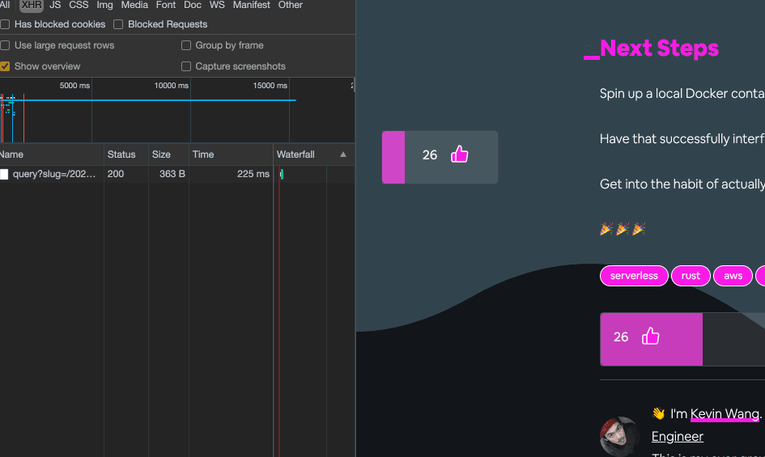

[](https://app.netlify.com/sites/musing-pare-709e6b/deploys)
[](https://codeclimate.com/github/thiskevinwang/coffee-code-climb/maintainability)
[](https://codeclimate.com/github/thiskevinwang/coffee-code-climb/test_coverage)

<p align="center">
  <a href="https://www.coffeecodeclimb.com">
    
  </a>
</p>
<h1 align="center">
  Coffee Code Climb
</h1>

Some blog posts about code, but mostly distrating animations.

### Medium's Claps



### Icon Trail

- [ ] Add gif

### Card Shuffling

- [ ] Add gif

So far I've written random things about...

- 🟦 TypeScript
- 🤦🏻‍♂️ Coding Questions
- 🦀 Rust
- 🐳 Docker
- ⚛️ React

## Testing on a mobile device

### Run `gatsby develop -H 0.0.0.0`

- ```
  You can now view coffee-code-climb in the browser.
  ⠀
    Local:            http://localhost:8000/
    On Your Network:  http://192.168.1.102:8000/
  ```

#### [Optional] Run the Apollo API on this host

```diff
- server.listen({ port: 4044 })
+ server.listen({ port: 4044, host: "192.168.1.102" })
  or
+ server.listen({ port: 4044, host: process.env.HOST })
```

#### [Optional] Make sure any S3 buckets have proper CORS Permissions json

```json
[
  {
    "AllowedHeaders": ["*"],
    "AllowedMethods": ["PUT"],
    "AllowedOrigins": [
      "http://192.168.1.102:8000",
      "http://localhost:8000",
      "https://coffeecodeclimb.com"
    ],
    "ExposeHeaders": []
  }
]
```

#### [Optional] `chrome://inspect` for mobile console logs

Open a tab to `chrome://inspect` — choose when to **start**/**stop** logging
Open another tab to `http://192.168.1.102:8000`
