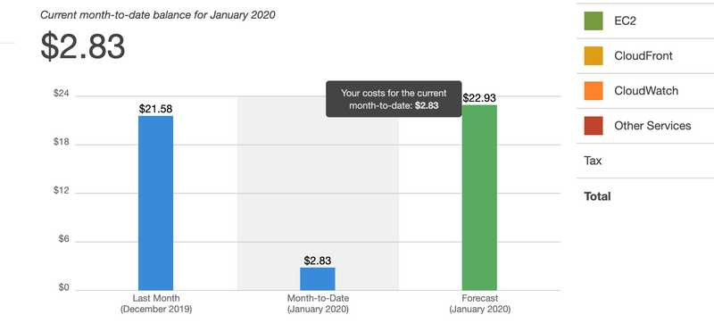
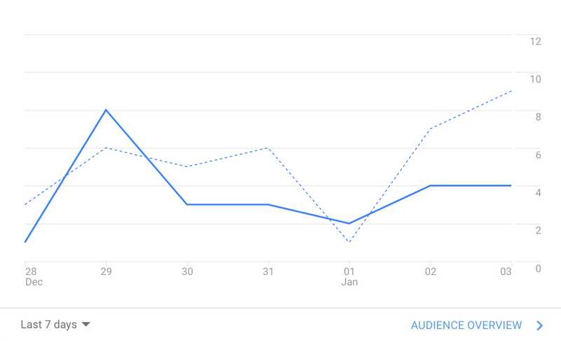

A little over a year ago, December 2018, is around when I really got serious about learning programming. One of the things I did to help motivate myself to learn was sign up for Amazon Web Service's free year. In my head, it was basically a race against time to _make best use of AWS_ before I started having to pay.

Fast forward through the free year, I dabbled a tiny bit with [CloudFront](https://aws.amazon.com/cloudfront/), did a lot of manual uploading to [S3](https://aws.amazon.com/s3/) for my first (now deprecated) website, failed to really learn [Lambda](https://aws.amazon.com/lambda/) and [API Gateway](https://aws.amazon.com/api-gateway/), and essentially just discovered [RDS](https://aws.amazon.com/rds/) a bit too late.

Two weeks ago, I wanted to figure out two things that I didn't really know:

- **How to structure a database**, which for me was inspired by a frontend library doc - [Redux: Normalizing State Shape](https://redux.js.org/recipes/structuring-reducers/normalizing-state-shape/)
- **Animations** based on SSR data & events.

I crammed a ton, and built a GraphQL Apollo API, connected to an RDS instance. I also extended my blog's code with several UI features to interfance with this new API.

<iframe src="https://www.linkedin.com/embed/feed/update/urn:li:ugcPost:6614551817395150848" height="535" width="504" frameborder="0" allowfullscreen="" title="Embedded post"></iframe>

...Then I got a bill from AWS.

<figure style="text-align: center">
  
  <small style="color: grey">"$22 per month? 😰"</small>
</figure>

AIN'T NOBODY GOT TIME TO PAY FOR A NOT-PROFITTING DATABASE. My AWS free year was over. It was time to find a free alternative, because free is good.

## Docker + Postgres

I decided to look into this for the sake of continuing local development and learning (this is the most important thing). Of course, my production blog would no longer be talking to any database, but the traffic that my blog gets is...

<figure style="text-align: center">
  
  <small style="color: grey">"**crickets chirping**"</small>
</figure>

...negligible.

The whole time while developing the API, I was doing work against an RDS instance. I just needed a few values from my AWS RDS console, and TypeORM would handle the connection for my GraphQL server. But now that RDS was being replaced by a local Docker container, I had to learn some new things.

### How Do I Connect?

#### Run The Container

I found my answer in this [stack overflow post](https://stackoverflow.com/questions/37694987/connecting-to-postgresql-in-a-docker-container-from-outside), but I wanted to understand what the commands I was running were actually doing. (A while ago, I did a [quick run through](/oct-12-2019/#run-a-command-in-a-new-container) of Docker commands for myself. But with life as we know it, I forgot everything. Ha.)

```bash
docker run --name some-postgres -e POSTGRES_PASSWORD=mysecretpassword -d -p 5432:5432 postgres
           ├ [Options]                                                                ├ IMAGE[:TAG|@DIGEST]
#          --name (Container Name)                                                    postgres
#                               -e (EnvirontmentVariable=Value)       -d (Detached mode)
#                                                                        -p (Host:Container)

6db70e055dee9bb1c96a8aaec319c283d3711a2792caaf31995cda05ca162967
```

[run-docs](https://docs.docker.com/engine/reference/commandline/run/)

Here's my understanding of what this command is doing, in english.

> Hey Docker, run, in a container named **some-postgres**, with one **environment variable** named "POSTGRES_PASSWORD", in [detached mode](https://docs.docker.com/engine/reference/run/#detached-vs-foreground), on **host-port** 5432 and **container-port** 5432, using the [postgres](https://hub.docker.com/*/postgres) image.

Now the container is available at `localhost:5432`

#### Check your docker processes

```bash
docker ps

CONTAINER ID        IMAGE               COMMAND                  CREATED             STATUS              PORTS                    NAMES
6db70e055dee        postgres            "docker-entrypoint.s…"   5 seconds ago       Up 3 seconds        0.0.0.0:5432->5432/tcp   some-postgres
```

> Hey Docker, list all my containers

#### Bash into your container

```bash
docker exec -it 6db70e055dee bash
            ├ [Options]
            # -i (Interactive)
            # -t (Psuedo Terminal)
                ├ [Container]
                # 6db70e055dee
                             ├ [Command]
                             # bash

# root@6db70e055dee:/#
```

> Hey Docker, I want you to run `bash` in my container `6db70e055dee`, and keep the STDIN open, and allocate a psuedo terminal.

At this point I'm in an [interactive bash process](https://stackoverflow.com/questions/29125177/what-exactly-does-the-unix-bash-command-do-when-run-without-options), inside my Docker container!

#### Create a database inside your container

Now this is leaving Docker territory, and going into [postgresql](https://www.postgresql.org/docs/9.3/app-psql.html)'s interactive terminal territory.

```
root@6db70e055dee:/# psql -U postgres

# psql (12.1 (Debian 12.1-1.pgdg100+1))
Type "help" for help.
```

> Hey Postgres, connect to the database as the user, "postgres"

```
postgres=# CREATE DATABASE mytest;
postgres=# \q
```

> Alright, now [create a database](https://www.postgresql.org/docs/9.0/sql-createdatabase.html) named "mytest". Then quit.

### Database is ready to connect via TypeORM

We're basically _back in business_. The new postgresql database has been created inside the docker container and my GraphQL node server should be able to connect to it via TypeORM. I just have to update my config file, or inline connection params.

<small>ormconfig.yml</small>

```yaml
default:
  type: "postgres"
  host: "localhost"
  port: 5432
  username: "postgres"
  password: "mysecretpassword"
  database: "postgres"
  # plus more...
```

## Next Steps

Figure out to save my local database data if my docker container is shutdown.

- see [here](https://stackoverflow.com/questions/41637505/how-to-persist-data-in-a-dockerized-postgres-database-using-volumes)

Weep over my broken relationship with RDS...

Get back to learning TypeORM. I wanted to figure out fetching paginated data, via UI scroll position. Probably query caching too.

Think about making a service that uses RDS, that is funded by community donations, or maybe Patreon patrons.
