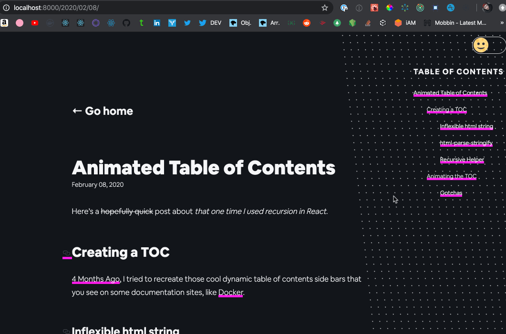

Here's a ~~hopefully quick~~ post about _that one time I used recursion in React_.

## Creating a TOC

[4 Months Ago](https://github.com/thiskevinwang/coffee-code-climb/commit/2196e395dfba7ae20f361b83d0f7d2d564425a80), I tried to recreate those cool dynamic table of contents side bars that you see on some documentation sites, like [Docker](https://docs.docker.com/storage/).

### Inflexible html string

I used [`gatsby-transformer-remark`](https://www.gatsbyjs.org/packages/gatsby-transformer-remark/)'s built-in "tableOfContents" option, which parses your markdown for `h1` to `h6` tags, and returns an html-string, like:

```
"<ul>↵<li>↵<p><a href="/2020/02/02/#reminders-to-myself">Reminders to myself…</a></p>↵<ul>↵<li><a href="/2020/02/02/#whats-the-movtivation-behind-pract..."
```

And if you console-log it and indent it correctly, it looks like:

```html
<ul>
  <li>
    <p><a href="/2020/02/02/#reminders-to-myself">Reminders to myself…</a></p>
    <ul>
      <li>
        <a
          href="/2020/02/02/#whats-the-movtivation-behind-practing-coding-questions"
          >What’s the movtivation behind practing coding questions?</a
        >
      </li>
      <li><a href="/2020/02/02/#dont-be-lazy">Don’t be lazy</a></li>
      <li>
        <a href="/2020/02/02/#use-any-helpful-tools">Use any helpful tools</a>
      </li>
    </ul>
  </li>
  <li>
    <p><a href="/2020/02/02/#the-question">The question</a></p>
    <ul>
      <li><a href="/2020/02/02/#my-answer">My answer</a></li>
      <li><a href="/2020/02/02/#approach">Approach</a></li>
      <li><a href="/2020/02/02/#time-complexity">Time Complexity</a></li>
      <li><a href="/2020/02/02/#space-complexity">Space Complexity</a></li>
    </ul>
  </li>
  <li><a href="/2020/02/02/#next-steps">Next Steps</a></li>
</ul>
```

Initially, the only way I could see how to use this was via React's `dangerouslySetInnerHTML`

```tsx
const { tableOfContents } = pageContext

return <div dangerouslySetInnerHTML={{ __html: tableOfContents }} />
```

But this was extremely unflexible. I couldn't figure out how to attach event handlers or styles to the html string.

### html-parse-stringify

3 months later, one of my co-workers turned me onto an npm package called "html-parse-stringify", which takes an html string, and returns an [AST](https://en.wikipedia.org/wiki/Abstract_syntax_tree) containing the different dom tags. I didn't make any connection that this would be useful until after I did some leetcode binary tree coding questions, where recursion was very handy.

I studied the output of `parse`, and I manually created interfaces for two distinct node-types that I noticed: `LeafNode` & `ASTNode`.

```tsx
import { useCallback } from "react"
import { parse } from "html-parse-stringify"

interface LeafNode {
  type: "text"
  content: "↵"
}
interface ASTNode {
  type: string
  name: string
  voidElement: boolean
  attrs: any
  children: (LeafNode | ASTNode)[]
}

// props.__html contains the passed-down html string
// generated by gatsby-transformer-remark
const ast: [ASTNode] = useCallback(parse(__html), [])
```

### Recursive Helper

I wrote a recursive helper function to traverse the output of of `parse`, which initially had two cases:

- Base Case: If the node has no children, return `node.content`, which was just `"↵"`

- Default Case: Return `React.createElement` with the node's name, attributes, and recursively call itself to generate the element's 'children'

```tsx
const generateTree = useCallback(
  (nodes: (ASTNode | LeafNode)[]): React.ReactNode => {
    return nodes.map(node => {
      if (!node.children) return node.content

      return React.createElement(
        node.name,
        node.attrs,
        generateTree(node.children)
      )
    })
  },
  []
)

const tree = generateTree(ast)

return <Container>{tree}</Container>
```

This allowed me to render the same TOC as before (basically some `ul`, `li`, and `a` tags), but without resorting to `dangerouslySetInnerHTML`.

I think this was **the first time** I actually successfully used recursion, outside of random coding questions.

## Animating the TOC

Here's where stuff got messy.

In order to animate the TOC, I had to add one more case to my recursive function. I needed to intercept nodes when they were `a` tags.

This case does a lot:

- attach a `ref` to each `a` tag
- for each `a` tag, find the associated `h#` tag
- create an `IntersectionObserver` to observe each `h#` tag
- mutate each `a` tag's `className` based on if the associated `h#` tag 'intersecting'. CSS will apply styles/animations to the updating `className`s
- mutate each `h#` tag's `className` based on if it iself is 'intersecting'
- update the `window`'s `hash`, based on the 'intersecting' `h#` tag
- attach custom `onClick` handler, to prevent the window from "jumping" when clicking links

```ts
if (node.name === "a") {
  const hash = node.attrs.href
    .replace(window.location.pathname, "")
    .replace("#", "")

  // this needs run after useEffect, aka after the browser
  // gets a chance to paint
  const anchorEl = document.getElementById(hash)
  const offset = anchorEl?.offsetTop

  // create a ref to attach to each TOC <a> tag
  const ref = React.createRef()

  // IO options
  const options = {
    root: null,
    rootMargin: "0px 0px -70%",
    threshold: 1.0,
  }

  const updateHashTo = (hash: string) => {
    history.replaceState
      ? // IE10, Firefox, Chrome, etc
        window.history.replaceState?.(null, null, `#${hash}`)
      : // IE9, IE8, etc
        (window.location.hash = hash)
  }

  // create intersectionObservers to watch if the Header tags
  // are intersecting with a specified area
  const observer = new IntersectionObserver(([entry], observer) => {
    if (entry.isIntersecting) {
      ref.current.className = "TOC TOC__FOCUS"
      entry.target.className = "HEADER HEADER__FOCUS"
      updateHashTo(hash)
    } else {
      ref.current.className = "TOC"
      entry.target.className = "HEADER"
    }
  }, options)
  observer.observe(anchorEl)

  return React.createElement(
    node.name,
    {
      ref,
      ...node.attrs,
      onClick: e => {
        // prevent jumping - but also prevents updating window hash
        e.preventDefault()
        updateHashTo(hash)
        window.scrollTo({
          top: offset,
          behavior: "smooth",
        })
      },
    },
    generateTree(node.children)
  )
}
```

### Gotchas

Look at this chunk from the code snippet above:

```ts
// this needs run after useEffect, aka after the browser
// gets a chance to paint
const anchorEl = document.getElementById(hash)
const offset = anchorEl?.offsetTop
```

Like the comment says, for `document.getElementById` to be able to find the corresponding `h#` tags, the entire recursive function needs to be run **after** the browser has a chance to paint.

`React.useEffect` - [docs](https://reactjs.org/docs/hooks-effect.html#tip-optimizing-performance-by-skipping-effects)

> Also, don’t forget that React defers running useEffect until after the browser has painted, so doing extra work is less of a problem.

So, let the browser paint.

```tsx
const [generated, setGenerated] = useState()
useEffect(() => {
  setGenerated(generateTree(ast))
}, [])
```

That's about it.

## Next Steps

I’m trying to pick up `Rust` as a second, lower level language, and in hopes to better understand `deno` (the node remake, built with Rust & TypeScript).
