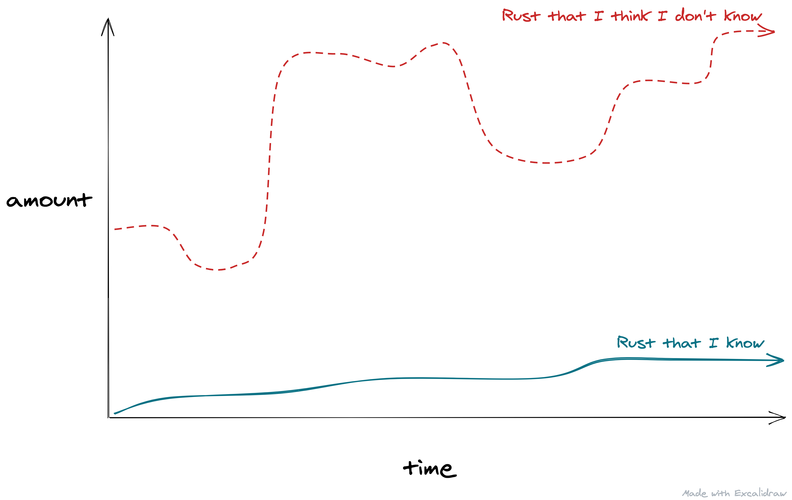
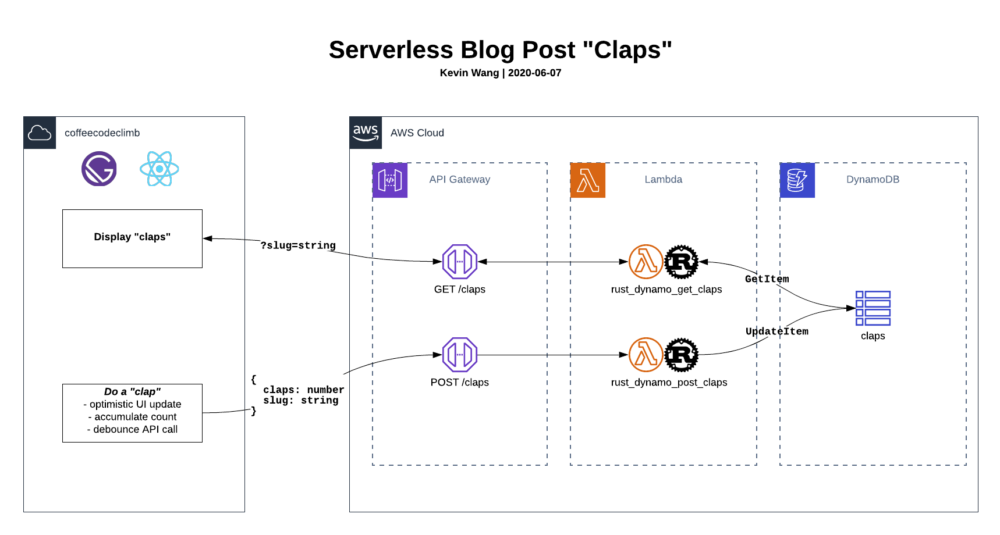
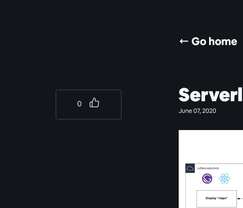

Sometime back around February, I stumbled upon this [Podcast Episode on Rust](https://www.heroku.com/podcasts/codeish/34-an-introduction-to-rust) during one of my morning commutes to work, and was sold on learning [Rust](https://www.rust-lang.org/).

Why? At the time, I was a little burned out by [React](https://reactjs.org/) and JavaScript/TypeScript (what I used for work), so I figured learning a second language and more specifically, my first low-level language, was worth a shot.

The following weeks would feel like a rollercoaster in terms of my learning in Rust, computers, programming, and many other things.

**ℹ️ Note to self:** Write a post on learning processes and methods ([Rustlings](https://github.com/rust-lang/rustlings), [Leetcode](https://leetcode.com/), [Exercism](https://exercism.io/), making things)

## The Mission

Fast forward a bit, after dabbling with Rust "crates" like [Actix](https://actix.rs/) (web framework), [Diesel](http://diesel.rs/) (ORM), and even making a [MacOS system notification CLI tool](https://www.reddit.com/r/rust/comments/gq4ocy/my_first_rust_project_a_cli_that_sends_a_system/), I came up with a miraculously fun idea, two days ago, to **recreate [Medium](https://medium.com/)'s "claps" feature**.

I had some constraits for myself:

- make this _serverless_ (but don't use [Serverless](https://www.serverless.com/))
- don't rely on a PaaS (like [Vercel](https://vercel.com))
- handle deployment and infrastructure myself
  - AWS API Gateway
  - AWS DynamoDB
  - AWS Lambda
- write lambda execution code in Rust

## Architecture

## Helpful sources

Serde

Rusoto

AWS Lambda Runtime

## Struggles

### Local Development

Compiler helpful

Executing directly in AWS

Sanity checks by swapping out Rust lambda funcs with node lambda funcs

### JSON String to Struct

String to byte vector

Serde from bytes, to struct

malformed lambda response

## Feature in action

Minim dolor tempor elit exercitation reprehenderit ut voluptate cupidatat cupidatat ad eu anim. Velit sint consequat amet consequat Lorem consectetur ut non Lorem eiusmod dolore qui. Nulla eu ipsum elit qui occaecat id eiusmod non deserunt esse dolor eiusmod in. Sint in consectetur nisi aute cupidatat exercitation.

## Learnings

JSON to Struct

Dynamo Atomic Counter and update item to update OR set item.

React client side state management

Medium uses GraphQL

https://joshwcomeau.com/blog/local-testing-on-an-iphone/
