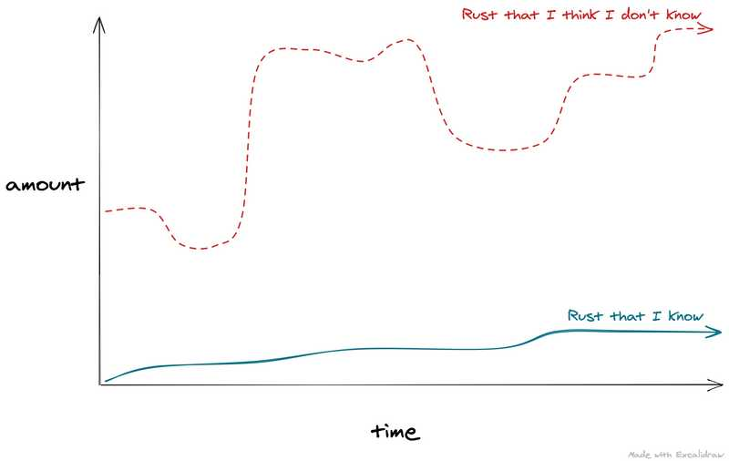
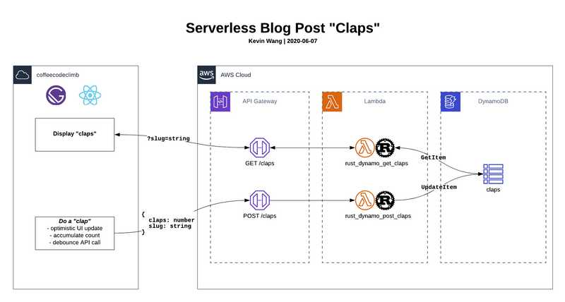
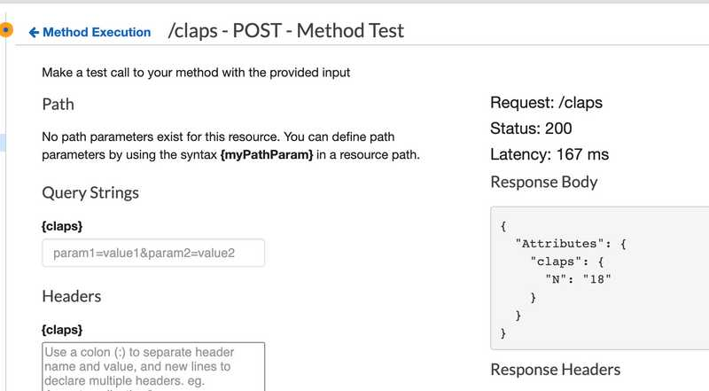

Sometime back around February, I stumbled upon this [Podcast Episode on Rust](https://www.heroku.com/podcasts/codeish/34-an-introduction-to-rust) during one of my morning commutes to work, and was sold on learning [Rust](https://www.rust-lang.org/).

Why? At the time, I was a little burned out by [React](https://reactjs.org/) and JavaScript/TypeScript (what I used for work), so I figured learning a second language and more specifically, my first low-level language, was worth a shot.

The following weeks would feel like a rollercoaster in terms of my learning in Rust, computers, programming, and many other things like general motivation and self doubt.



**ℹ️ Note to self:** Write a post on learning processes and methods ([Rustlings](https://github.com/rust-lang/rustlings), [Leetcode](https://leetcode.com/), [Exercism](https://exercism.io/), side projects)

## The Mission

Fast forward a bit, after dabbling with Rust _crates_ (how Rust packages are referred to) like [Actix](https://actix.rs/) (web framework), [Diesel](http://diesel.rs/) (ORM), and even making a [MacOS system notification CLI tool](https://www.reddit.com/r/rust/comments/gq4ocy/my_first_rust_project_a_cli_that_sends_a_system/), I felt like I was not making anything _fun_.

Two days ago I came up with a miraculously fun idea, to **recreate [Medium](https://medium.com/)'s "claps" feature**.

I had set some constraits for myself:

- make this **_serverless_** (but don't use [Serverless](https://www.serverless.com/))
- **_don't rely on a PaaS_** (like [Vercel](https://vercel.com))
- handle deployment and infrastructure myself
  - AWS API Gateway
  - AWS DynamoDB
  - AWS Lambda
- **write lambda execution code in Rust 🤪**

## Architecture

Going into this project, I had a vague idea of all the the moving parts, sort of a like a freshly opened Lego kit. It wasn't until _after_ I actually finished the feature that I went backwards a step to create this systems diagram.

Looking back, diagramming first would've been ideal but figuring things out on the fly also made this fun in an explorative way... I guess like building a Lego kit without the instruction manual 😮.



## Essential [Crates](https://crates.io/)

I needed to use these crates to handle some key functionality of this feature.

### `serde`

- https://github.com/serde-rs/serde

> Serde is a framework for serializing and deserializing Rust data structures efficiently and generically.

### `rusoto`

- https://github.com/rusoto/rusoto

The Rust equivalent of the [AWS SDK for JavaScript](https://docs.aws.amazon.com/AWSJavaScriptSDK/latest/). Unfortunately this only has an equivalent of [AWS.DynamoDB](https://docs.aws.amazon.com/AWSJavaScriptSDK/latest/AWS/DynamoDB.html), but not [AWS.DynamoDB.DocumentClient](https://docs.aws.amazon.com/AWSJavaScriptSDK/latest/AWS/DynamoDB/DocumentClient.html) (which exposes an API that accepts more idiomatic JavaScript to interface with DynamoDB).

### `lambda_runtime`

- https://github.com/awslabs/aws-lambda-rust-runtime

> This package makes it easy to run AWS Lambda Functions written in Rust.

This came with some crucial documentation for getting a custom Rust runtime into AWS Lambda. Currently, AWS only officially supports [Node.js](https://nodejs.org/en/), [Python](https://www.python.org/), [Ruby](https://www.ruby-lang.org/en/), [Java](https://www.java.com/en/), and [Go](https://golang.org/).

## Hurdles

AKA: hours of my life lost to the ~~stackoverflow~~ ~~the void~~ not caring to read and understand fundamental concepts thoroughly.

### Local Development

In local development in VSCode, the Rust compiler helped catch so many type errors, and essentially prevented me from uploading Lambda function code that wouldn't run. This was a huge plus thoroughout the development cycle.

I hadn't (and still haven't) figured out how to spin up a local Docker Rust runtime, so I ended up uploading new function code to Lambda and using the API Gateway test console, every time I needed to see the output of my Lambda execution code.



### JSON String to Struct

**I think I lost about 18 hours to this** - Saturday 8am to Sunday 2am. Initially, an API response error _looked like_ a CORS issue (missing `Access-Control-Allow-Origin` header). However I was definitely returning that header from Lambda code, so the problem **must have** been something else. I even did a sanity check by swapping out my Rust lambda function with a nearly identical Node.js function. No error. Ok...

I eventually narrowed it down to I was providing type annotations that pleased the compiler, but didn't actually represent incoming data.

#### String to byte vector to struct

Confusing long story short, this is how you deserialize a [JSON String](https://developer.mozilla.org/en-US/docs/Web/JavaScript/Reference/Global_Objects/JSON/stringify) into a typed [Rust struct](https://doc.rust-lang.org/stable/rust-by-example/custom_types/structs.html).

```rust
use serde_derive::{Deserialize, Serialize}; // 1.0.110;
use serde_json; // 1.0.53

// this is the data structure that I want to
// deserialize an incoming request payload into
#[derive(Serialize, Deserialize, Clone)]
struct Body {
    slug: String,
    claps: u32,
}

// this is the event object, coming from an
// API Gateway <> Lambda integration
struct Event {
    body: Option<String>, // <- troublesome request payload 👀
    #[serde(rename = "requestContext")]
    request_context: Option<RequestContext>,
}

// Inside Lambda handler
// async fn my_handler(e: Event) -> ...
    let body: Body = if let Some(json_string) = e.body {
        let byte_vector = json_string.into_bytes();
        serde_json::from_slice(&byte_vector).unwrap()
    } else {
        Body {
            claps: 0,
            slug: "init".to_string(),
        }
    };

    // access data on `body` to use in a Dynamo query
    format!("{}", body.claps);
```

#### Success

At around Sunday morning at 2am, I got everything to all my backend code to work (wow, a whole TWO functions 🤣😐)... fist pumped the air, in the dark, and went to bed.

<iframe src="https://giphy.com/embed/t3Mzdx0SA3Eis" width="480" height="270" frameBorder="0" class="giphy-embed" allowFullScreen></iframe><p><a href="https://giphy.com/gifs/excited-the-office-yes-t3Mzdx0SA3Eis">via GIPHY</a></p>

## Feature in action

I spent the next morning hooking up the client, or this blog (so meta!) to my **_Serverless, Rust Lambda Function powered API Gateway_**.


... and getting carried away with CSS.

## Learnings

- How to deserialize a JSON string into a Rust Struct
- How to create an "atomic counter" in DynamoDB from a potenially previously non-existent item
- How to queue up "claps" and _flush_ them in a debounced API call (React state and side effect management)
- Medium uses GraphQL
- [Josh W. Comeau]()'s blog was a source of inspiration on a nearly identical feature. I believe he uses "Netlify Functions" (but one of my constraints was to not rely on a PaaS)

## Next Steps

Spin up a local Docker container that simulates the AWS Rust lambda runtime.

Have that successfully interface with another local DynamoDB docker container.

🎉🎉🎉
