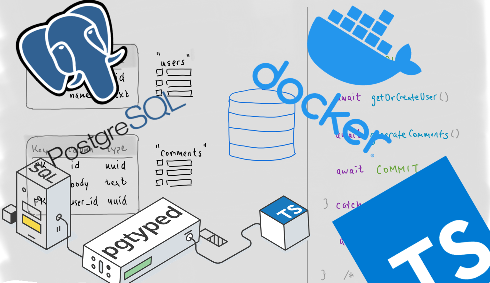
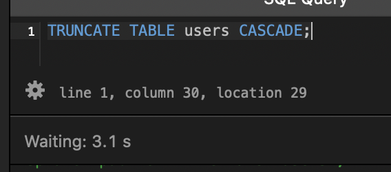

## Preface

Two weeks ago, I was given the opportunity at my workplace to work on a new backend microservice. It goes without saying that it was an honor for me to be asked to work on this project, but at the same time it turned out to be a fast track straight out of my daily comfort zone and into the deep end of a pool—awesome!

The first week consisted of technical spec writing, presenting, and getting asked questions that I coudn't answer about topics I didn't previously know about:

- Do you have a reconciliation plan?
- How will you protect against duplicate writes?
- Are your endpoints idempotent?
- How are you handling retry logic?
- Have you considered event-sourcing?


### SQL + Database Goals

I've previously relied on an ORM, like [TypeORM](https://typeorm.io/#/), to do my relational data bidding on personal projects so I never actually picked up SQL—it's like I've been riding a bicycle with training wheels. However, ORM usage was not approved for this service so I needed to get up to speed in SQL, from basically nothing—never wrote production level SQL, barely even wrote any hobby level SQL—and **fast**.

With all that said, I wanted to write about the SQL and database parts chunks of knowledge I picked up, mostly so I don't forget, and so that I have an embarassing blog post to look back on in the future. 🤣

## Idempotence

I think this is a word that you seldom hear if your world is strictly frontend development.

So what is [idempotence](https://en.wikipedia.org/wiki/Idempotence)?

Idempotence is a property of an operation such that running it 1000 times will have the same effect as running it once (successfully).

Here's my real-life analogy/scenario of idempotence:

> _Given a volume knob that goes from 0 up to 11_
>
> _Turning the volume up by one is not idempotent_
>
> _Turning the volume up to max is idempotent_

### Code

Here are two, beyond basic SQL snippets. One is idempotent and the other is not.

#### ❌ Not idempotent

```sql
CREATE EXTENSION "pgcrypto";
```

Assuming you're operating on a single database, this will work the very first time you run it, but every following run will produce an error result. Postgres will throw an error if you try to create an extention that already exists.

| Run  | Result | Stdout                              |
| :--- | :----- | :---------------------------------- |
| 1    | Ok     |                                     |
| 2    | Error  | extension "pgcrypto" already exists |
| 3    | Error  | extension "pgcrypto" already exists |
| n... | Error  | extension "pgcrypto" already exists |

There are **two different** outcomes—Ok and Error—so this is not idempotent.

#### ✅ Idempotent

One way to make the previous operation idempotent is to check for previous existence of your extension, row, constraint, or anything, and do nothing if it already exists.

```sql
CREATE EXTENSION IF NOT EXISTS "pgcrypto";
```

This is idempotent because no matter how many times you run this operation beyond the first successful run, it always produces the same outcome—Ok.

| Run  | Result | Stdout                                        |
| :--- | :----- | :-------------------------------------------- |
| 1    | Ok     |                                               |
| 2    | Ok     | extension "pgcrypto" already exists, skipping |
| 3    | Ok     | extension "pgcrypto" already exists, skipping |
| n... | Ok     | extension "pgcrypto" already exists, skipping |

## Atomicity

Another term that isn't part of the typical frontend repertoire.

What is [atomicity](<https://en.wikipedia.org/wiki/Atomicity_(database_systems)>)?

Atomicity represents the "A" in [ACID](https://en.wikipedia.org/wiki/ACID) transaction properties.

The best way I can describe an **atomic** [database transaction](https://en.wikipedia.org/wiki/Database_transaction) is that its operations are **_all or nothing_**. All of them must succeed for changes to be committed to the database, or else nothing is committed.

And yet another analogy 🙃:

> _You're looking for a match in Dota 2_
>
> _All 10 players are required to confirm readiness in order for a match to begin_
>
> _9 players confirm_
>
> _1 player is AFK, doesn't confirm, and the match times out_
>
> _You're all sent back to the matchmaking queue, and no match was recorded_

### Code

Here's an exapmle using real SQL. Take this table, **"friends"**, for example...

| column_name | data_type  |
| ----------- | ---------- |
| username    | varchar(8) |

#### ❌ Not atomic

The following SQL is not atomic. It will insert `'peas'`, `'in'`, and `'a'`, committing each to the database. It will fail to insert `'poooooooooood'` due to character length, and your "friends" table will be sad 😢.

```sql
INSERT INTO friends (username) VALUES('peas');
INSERT INTO friends (username) VALUES('in');
INSERT INTO friends (username) VALUES('a');
INSERT INTO friends (username) VALUES('poooooooooood');
-- ERROR:  value too long for type character varying(8)

```

#### ✅ Atomic

The standard approach to making this atomic is to use a **transaction**. The [BEGIN](https://www.postgresql.org/docs/9.0/sql-begin.html) keyword starts a transaction block and [COMMIT](https://www.postgresql.org/docs/9.0/sql-commit.html) commits the current transaction. If any operations inside the transaction fail, nothing gets committed.

The following SQL **is** atomic.

```sql
BEGIN;
INSERT INTO friends (username) VALUES('peas');
INSERT INTO friends (username) VALUES('in');
INSERT INTO friends (username) VALUES('a');
INSERT INTO friends (username) VALUES('poooooooooood');
COMMIT;
```

`'peas'`, `'in'` and `'a'` are all inserted, but not committed yet. `'poooooooooood'` eventually causes an exception to be raised and the entire transaction gets rolled back, resulting in nothing getting committed to the database.

## Applying Concepts



For me, reading typically gets me nowhere. I need to move things around, and make mistakes to better understand and ingrain concepts.

I made this [repository](https://github.com/thiskevinwang/sql-tinkering), as a distilled version of things I've been learning/applying in my actual project, like migrations and SQL queries with PgTyped.

### Migrations

This is both an **idempotent** and **atomic** transaction. The entire file can be run multiple times and each time will produce the same result, and if any individual operation fails, nothing would be committed.

I commented, in code, that some individual operations rely on previous operations to have completed.

```sql
BEGIN;

-- #1
CREATE EXTENSION IF NOT EXISTS "pgcrypto";

-- #2
-- Depends on #1 for gen_random_uuid()
CREATE TABLE IF NOT EXISTS "users" (
  "id" uuid DEFAULT gen_random_uuid(),
  "username" character varying (25) NOT NULL,
  CONSTRAINT "uq_users_username" UNIQUE ("username"),
  CONSTRAINT "pk_users_id" PRIMARY KEY ("id")
);

-- #3
-- Depends on #1 for gen_random_uuid()
CREATE TABLE IF NOT EXISTS "comments" (
  "id" uuid DEFAULT gen_random_uuid(),
  "body" character varying (25) NOT NULL,
  "user_id" uuid NOT NULL,
  CONSTRAINT "pk_comments_id" PRIMARY KEY ("id")
);

-- #4
-- Depends on #3 for creating the "comments" table
ALTER TABLE "comments"
  DROP CONSTRAINT IF EXISTS "fk_comments_user_id";

-- #5
-- Depends on #3 for creating the "comments" table
-- Depends on #4 for removing an existing constraint
ALTER TABLE "comments"
  ADD CONSTRAINT "fk_comments_user_id"
  FOREIGN KEY ("user_id")
  REFERENCES "users" (id);

COMMIT;
```

### Using PgTyped

This library has been pretty interesting to use. You write raw SQL and PgTyped will generate TypeScript type definitions as well as callable functions from it. PgTyped connects to your database and verifies if your queries adhere to or violate your schema, which is pretty awesome.

[./sql/example.sql](https://github.com/thiskevinwang/sql-tinkering/blob/master/sql/example.sql)

```SQL
/* @name getOrCreateUser */
WITH temp AS (
  INSERT INTO users (id, username)
  SELECT :id, :username
  WHERE NOT EXISTS (
    SELECT * FROM users
    WHERE id = :id)
  RETURNING *
)
SELECT *
FROM temp
UNION
SELECT * FROM users
WHERE id = :id;

/* @name insertComment */
INSERT INTO comments (body, user_id)
VALUES (:body, :userId);
```

Running `npx pgtyped -w -c config.json` generates an adjacent file, [./sql/example.queries.ts](https://github.com/thiskevinwang/sql-tinkering/blob/master/sql/example.queries.ts). This is where you can import your types and functions from.

#### Limitation

I opened this [issue (#142)](https://github.com/adelsz/pgtyped/issues/142), when I was struggling to get PgTyped to work with `BEGIN;` & `COMMIT;`. It turns out:

> pgTyped only supports single statement queries because type inference can only be done at single statement level in postgres.

The suggested way to handle this was to use the [pg](https://node-postgres.com/) client instance, and eplicity run individual single `BEGIN;` and `COMMIT;` statements,

```ts
function queryInTrx() {
  await client.query("BEGIN")
  await testQuery.run({ id: 123 }, client)
  await client.query("COMMIT")
}
```

### Tinkering

This is the code from [./index.ts](https://github.com/thiskevinwang/sql-tinkering/blob/master/index.ts). In a nutshell, it creates a `user`, and iterates over a 50 x 50 matrix, inserting 2500 `comments` into the database.

`./index.ts`

```ts
import { Client } from "pg"
import { createDb, migrate } from "postgres-migrations"

import {
  getOrCreateUser,
  IGetOrCreateUserParams,
  insertComment,
  IInsertCommentParams,
} from "./sql/example.queries"

const host = "localhost"
const port = 8080
const user = "postgres"
const password = "mysecretpassword"
const database = "postgres"

const client = new Client({
  host,
  port,
  user,
  password,
  database,
})

const WIDTH = 50
const MATRIX = Array(WIDTH)
  .fill(null)
  .map(() => Array(WIDTH).fill(null))

async function main() {
  await client.connect()
  await createDb(database, { client })
  await migrate({ client }, "./migrations")

  try {
    await client.query("BEGIN")

    let params: IGetOrCreateUserParams = {
      id: "a5f5d36a-6677-41c2-85b8-7578b4d98972",
      username: "test_user",
    }
    const [user] = await getOrCreateUser.run(params, client)
    console.log(`🤖 User:`, user.id)
    console.log("📝 Generating comments...")

    console.time("⏰ Generating comments took")

    const outerPromises = MATRIX.map((matrixRow, outerIndex) => {
      const innerPromises = matrixRow.map((_, innerIndex) => {
        let params = {
          body: `${outerIndex}__${innerIndex}`,
          userId: user.id,
        } as IInsertCommentParams

        return insertComment.run(params, client)
      })
      return Promise.allSettled(innerPromises)
    })
    await Promise.allSettled(outerPromises)
    console.timeEnd("⏰ Generating comments took")

    await client.query("COMMIT")
  } catch (e) {
    console.log(`Error: `, e)
    console.log(`❌ ROLLBACK`)
    await client.query("ROLLBACK")
  } finally {
    await client.end()
  }
}
main()
```

Running `yarn start`, outputs:

```
λ yarn start
yarn run v1.22.4
$ ts-node .
🤖 User: a5f5d36a-6677-41c2-85b8-7578b4d98972
📝 Generating comments...
⏰ Generating comments took: 5341.766ms
✨  Done in 7.25s.
```

### Isolation

The **"I"** in [ACID](https://en.wikipedia.org/wiki/ACID#Isolation).

The previous SQL transaction from above takes roughly 6 seconds to finish, but it could take longer if you modify the the `WIDTH` value to something larger than `50`.

While the script is still running, if you go into a database GUI and run a query, you'll now have two **concurrent** transactions running.

#### Locks

I tried this in TablePlus—clearing the `users` table and clearing all related rows in the `comments` table.

```sql
TRUNCATE TABLE users CASCADE;
```

But TablePlus waited a bit for the TypeScript/Node script to finish before finally executing.



This happens because the long-running application code implicitly tells Postgres to acquire either a [table-level lock](https://www.postgresql.org/docs/9.4/explicit-locking.html#LOCKING-TABLES) or a [row-level lock](https://www.postgresql.org/docs/9.4/explicit-locking.html#LOCKING-ROWS) on the `users` and `comments` tables... I need to clarify this for myself.

## Final Thoughts

I explained idempotency, and touched upon the **A** and **I** in **ACID**—atomicity and isolation. I still have yet to understand consistency and durability. I'd also like to understand "event sourcing", "PRG", "eventual consistency".

I didn't really talk about specific SQL how-tos, but most of my hours felt like they were spent on figuring out some data aggregation patterns. In a separate post, I should explain what a CTE is, and show some common queries that I figured out.

Reading material...

- https://medium.com/airbnb-engineering/avoiding-double-payments-in-a-distributed-payments-system-2981f6b070bb
- https://www.confluent.io/blog/exactly-once-semantics-are-possible-heres-how-apache-kafka-does-it/
- https://stackoverflow.com/questions/37247231/using-aggregate-version-numbers-to-be-idempotent-when-using-event-sourcing
