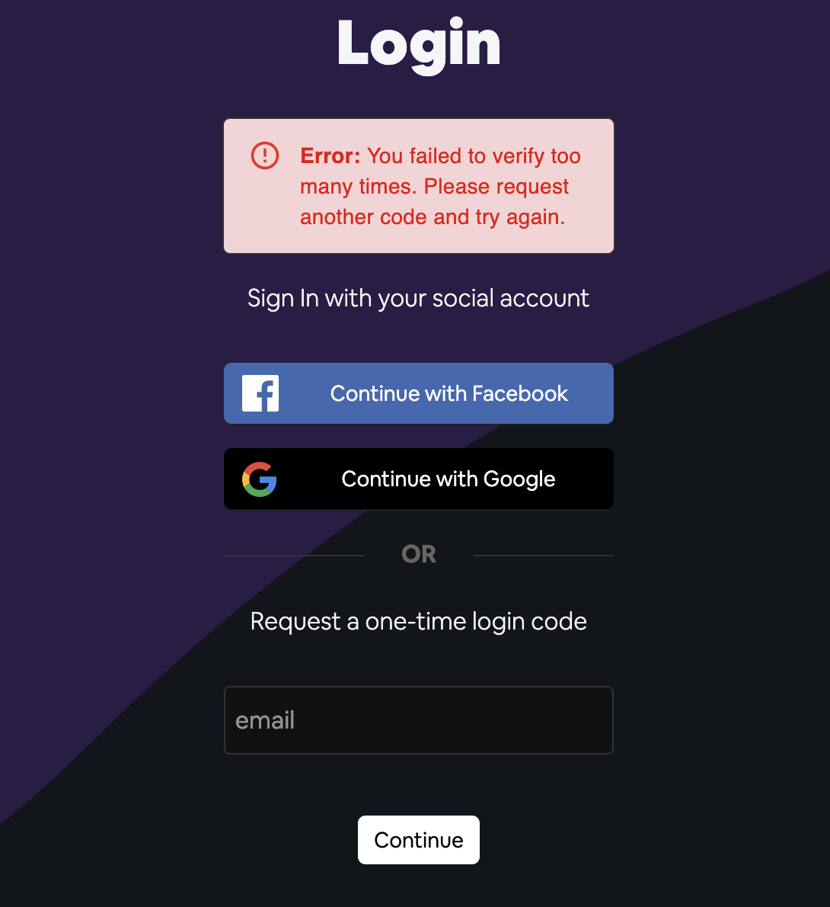

# Quick overview

Here's what I've been up to in Q4 of 2020: Building, building, building... And thinking about things like, "how to scale, and how be secure. This is a super brief recap of some

## AWS Cognito

This was the first piece of tech I wanted to learn, and the driving force was work requirements — I switched teams and needed to finish off the tail end of a Cognito implementation, despite never having used it before nor having any dedicated experience in authentication and authorization. Looking back, that was kind of a proud accomplishment in my books at least.

On my own time I went on to learn about federated identities (Cognito <> Facebook <> Google), and implemented both social sign-in and passwordless (temporary PIN) email authentication on this blog itself.

<!-- Share some screenshots -->

  <figure style="flex: 1 400px; margin: 5px;">
    
    <figcaption style="text-align: center;">When a user begins the email authentication flow</figcaption>
    

  </figure>

  <figure style="flex: 1 400px; margin: 5px;">
    
    <figcaption style="text-align: center;">Example of the emailed PIN</figcaption>
    

  </figure>

  <figure style="flex: 1 400px; margin: 5px;">
    
    <figcaption style="text-align: center;">The UX when the user fails to enter the correct PIN, 3 times</figcaption>
  </figure>
  

## Pretty UI

I've also been thinking about building a _pretty_ app. I thought Vercel's UI was really _cool_, so I copied it. Plain and simple, and no time wasted on decision making!

I used Vercel's css stylesheet with MaterialUI's component library, and recreated components like [fieldset](https://vercel.com/design/fieldset) from their component library. I also constantly looked at their logged-in dashboard for layout and other various inspiration. In the end, I tried to timeblock myself for anything style/css because I found myself going down rabbit holes.

<!-- Share some screenshots-->

  <figure style="flex: 1 400px; margin: 5px;">
    
    <figcaption>UI screenshot (light)</figcaption>
  </figure>
  <figure style="flex: 1 400px; margin: 5px;">
    
    <figcaption>UI screenshot (dark)</figcaption>
  </figure>

## Github Discussions

[Github Discussions](https://github.blog/2020-05-06-new-from-satellite-2020-github-codespaces-github-discussions-securing-code-in-private-repositories-and-more/) have been around since May, but I didn't really notice it until very recent.

I simply wanted to recreate this feature, using DynamoDB, as a learning exercise. So I did. There was a lot I had to juggle between the API design, and UX flow, and the bulk of the challenge was the DynamoDB key modelling.

Alex DeBrie states in his [dynamo db talk](https://www.youtube.com/watch?v=DIQVJqiSUkE) that you need to approach DynamoDB with a query-first mindset rather than the entity-first mindset for traditional relational databases, so I wrote down a ton questions, on paper, like:

- Do I want to paginate my query for discussions?
- Should I include all comments and replies under a parent partition key for a single discussion?
- How do manage many users to many discussions/comments/replies?

I learned a ton of things like how to sort DynamoDB items, how to use different global secondary indexes to support more query patterns, and what "eventual" and "strong" consistency are.

I also impulse-bought [The DynamoDB Book](https://www.dynamodbbook.com/) 😅. I never got along with books, but it has been useful to a small degree.

  <figure style="flex: 1 400px; margin: 5px;">
    
    <figcaption>Screenshot of my rendition of GitHub Discussions</figcaption>
  </figure>
  <figure style="flex: 1 400px; margin: 5px;">
    
    <figcaption>Screenshot of Comments and Replies on a Discussion</figcaption>
  </figure>

## Mobile-correct Avatar crop & upload

About I a year ago, I made a feature to upload a and crop a user avatar, but at the time, I never quite two issues on mobile — EXIF data cause your image to rotate, and EXIF data cause my cropper preview to traverse the image in rotated directions as well.

I revisited this super spaghetti code, and eventually got it working. It was enough of a headache that I should probably write a dedicated post about it.

  <figure style="flex: 1 400px; margin: 5px;">
    
    <figcaption>Screenshot of mobile-correct avatar crop & upload</figcaption>
  </figure>
  <figure style="flex: 1 400px; margin: 5px;">
    
    <figcaption>Dry run of mobile-correct avatar crop & upload</figcaption>
  </figure>

## What's next?

It's already been a few days since I started writing this post, and I've been moving on to other projects. But I do want to keep of some to-do's that are a result of these features I worked on.

### Todo List

- [ ] Write a dedicated post on AWS Cognito: Passwordless login and Federated login with Social Identity Providers..
- [ ] Write a dedicated post on DynamoDB key-modeling for using multiple entities in a single table design.
- [ ] Write a dedicated post on EXIF data handling for mobile-correct image crop and upload.

## Next Project — Infrastructure as Code & CI/CD

My next two goals are to learn the [AWS-CDK](https://aws.amazon.com/cdk/) and set up a CI/CD pipeline with Github Actions.

<figure >
  
  <figcaption>Preview of my next project — Infrastructure as Code and CI/CD</figcaption>
</figure>

Thanks for reading! That is all for now.
