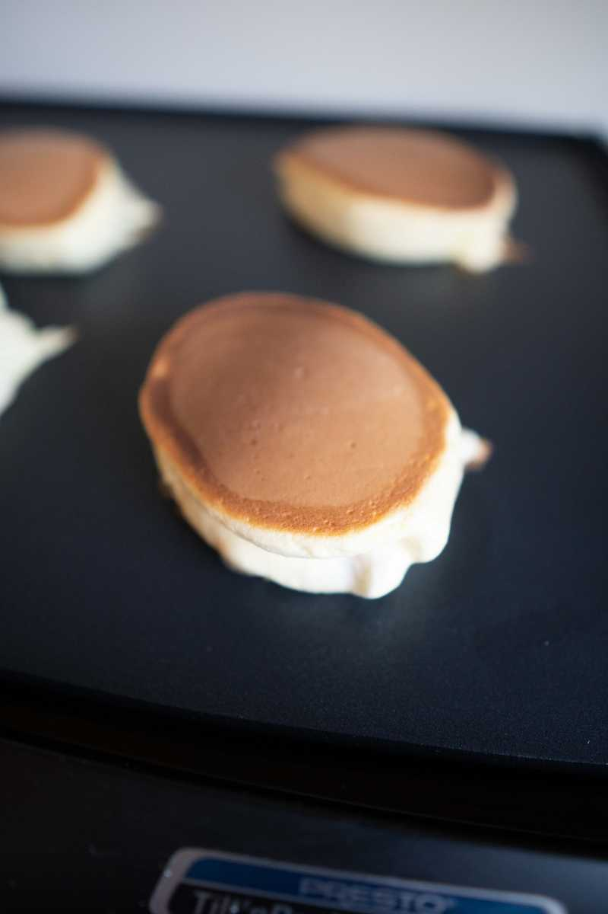

## I barely remember what happened...

I'm sitting here, on a Sunday night (it's 10:16pm), and I'm having a tough time reflecting on what I did this weekend...

# Saturday

## Open Source

I woke up at about 9am, got straight on my computer to work on adding to this blog. I managed to find a typo on the [Gatsby](https://www.gatsbyjs.org/) docs, so I fixed it and opened [PR #12799](https://github.com/gatsbyjs/gatsby/pull/12799). Baby steps towards contributing towards open source! 🚼

## Swim

Connie and I went for a swim at [Flushing Meadows Corona Park Aquatic Center](https://www.google.com/search?tbm=lcl&ei=jTyYXIutPIaJggfviY-wDQ&q=flushing+meadows+corona+pool&oq=flushing+meadows+corona+pool&gs_l=psy-ab.3..0j0i22i30k1l4j38.15169.20934.0.21053.32.22.2.8.9.0.140.1861.16j6.22.0....0...1c.1.64.psy-ab..0.32.1885...35i39k1j0i67k1j0i131k1j0i20i263k1j0i131i67k1j0i22i10i30k1j0i13k1.0.YVIdytM6-2o#rlfi=hd:;si:12475983447994039364;mv:!1m2!1d40.751960077319026!2d-73.83742002020021!2m2!1d40.75160012268097!2d-73.83789517979979), which was quite the struggle for me. She's quite the strong swimmer, while I am not.

## Chinatown

After the swim, we drove down to Chinatown to pic up some photos that Connie sent to get developed. We ended up stuffing our faces with Banh Mis, and other bad choices...

|                           |                                     |
| ------------------------- | ----------------------------------- |
|  |  |

I immediately passed out when we got home.

# Sunday

## ~~Auth0~~ AuthFail

Once again, I woke up at 9am to get some work in on this blog. I _ATTEMPTED_ to implement an authentication feature, which happened to work fine in my `development` environment. I had spent several hours on it and was pretty happy with what I had built, but when it came time to deploy it, I encountered a bug when the project was being built. The error looked like:

```shell
window is not defined

auth0.min.esm.js:8
```

I'm good at googling... but couldn't find the solution/fix, so I ended up just scrapping the changes and now I plan to redo/revisit it later... 🤦🏻‍♂️ 😡


## Soufflé Pancakes

Connie and I took a shot at making these for the first time.

|                             |                             |                             |
| --------------------------- | --------------------------- | --------------------------- |
|  |  |  |

- Grade: Solid **B-**
  - we blame the recipe
  - I should probably write more about these.
- They go great with parmesan cheese.

## Climb & Coffee

We went to the Cliffs @ LIC... We bought some coffee... Now I'm here writing this, and about to pass out... 😴


# TODOs

- [ ] figure out how to resize images in Markdown
- [ ] figure out where to upload images to avoid bloating-up this project repo
- [ ] find more time to write more thoughtful posts, rather than these mash-ups
- [ ] try to implement authentication, again...
- [ ] check if I finished any of the **TODOs** from the previous posts
