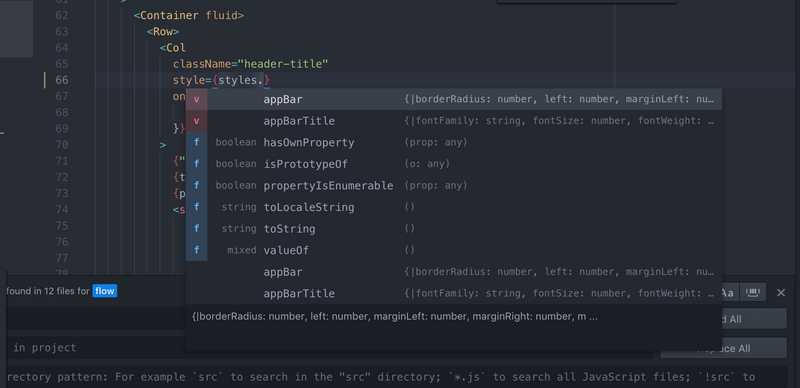
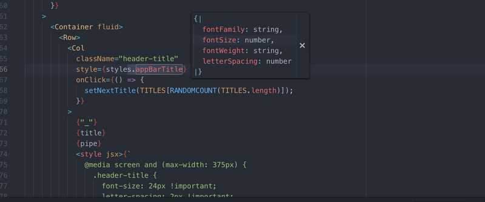

> FLOW IS A STATIC TYPE CHECKER FOR JAVASCRIPT.

## I like to install flow wherever I go

Funnily enough (at the time of writing this post) I'm checked out on a branch titled `add-flow`. When I get started on a project, I usually make a PR to install flow. Here's the few quick steps I manually go through (and open to suggestions about how to automate this!):

1. In terminal, in the project root directory:

- `npm install --save-dev flow-bin`

- In `package.json`, inside `"scripts": { ...`

  - add `"flow": "flow",`

- Run
  - `npm run flow init`
  - `npm run flow`

Then I commit the changes, push my branch, and open the PR!

## Why?

I'm not exactly sure when I even discovered [@flow](https://flow.org/en/), but I think it was because of some hot buzzwords like, **facebook**, **open-source**, and **type-checking**. ~~I easily succumb to F.O.M.O.~~ I'm a naturally curious person, so I just decided to check it out.

### Autocomplete & Type-Hinting

I enjoy [atom](https://atom.io/) as my text-editor (maybe I'll write about atom in another post 🤔), and as far as I've noticed, flow enables some nice Autocomplete & Type-Hinting popups when you're working.

So let's say I have a `const styles = { ...some properties in here }` defined. As I'm typing out `styles.`, I get this nice popup that displays the all the existing properties, and then some methods that can be called as well.

And when I go to hover over some bits of my code, I also get some nice type-annotation previews. (Please correct me if this is the wrong terminology.)

## There's more...

But I'm trying to juggle writing in between three phone interviews today, and it's proving to be quite a struggle, so I'll leave this post short and sweet.

## TODOs

- [x] Phone interview with TrilogyEd @ 2:30
- [ ] Write about what happens when you add `// @flow` at the top of a `.js` file.
- [ ] Write about my discoveries with type annotation & object destructuring
- [ ] Phone interview with Scoot Networks @ 4:00
- [ ] Phone interview with Sig.ma @ 5:30
- [ ] Go to climbing gym
