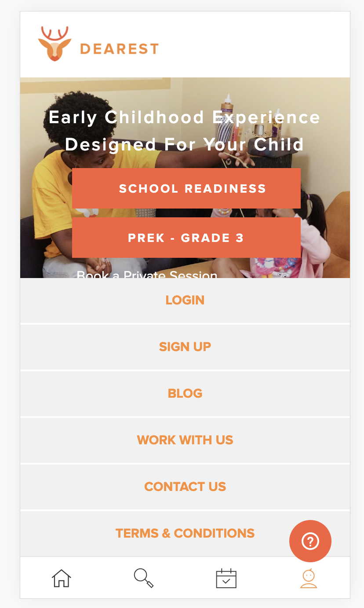
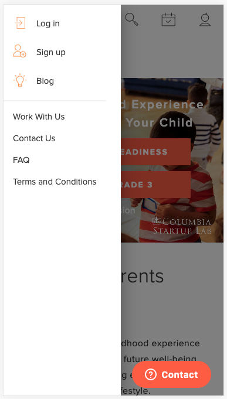

#### [part 1](/flow-part-1)

## This week has been super hectic

### Sunday

I believe it was Sunday night when I wrote a blog post about [the weekend being too short](/fast-weekend/), and then tweeted about it too. I @'d GatsbyJS, and I guess [Kyle Matthews](https://twitter.com/kylemathews) took note, and approved my first PR to Gatsby (a measely typo-fix, but hey you gotta start somewhere, right? #OSS #babysteps). Following the approval, I was invited to join the GatsbyJS team of maintainers...


For someone like me - someone still very fresh to programming, software engineering, coding, open source, the ow... - this was _really_... **_really_** cool.

### Monday

First thing I did after getting back to my internship Monday morning was write the first function component using [Hooks](https://reactjs.org/docs/hooks-intro.html). This was only possible after finally updating our codebase from `15.4.2` to `16.8.4` last week (which took about a month). The component was a `@material-ui` "drawer" component, just for our mobile view, the rendered different fields based on if a user was `loggedIn`, `isParent`, `isProvider`, or all three.

| Old                                             | New                                             |
| ----------------------------------------------- | ----------------------------------------------- |
|  |  |

### Tuesday

After thinking that I totally failed a phone screening with Scoot Networks, they replied out of nowhere, and presented me with a take-home coding assignment, as the _next step_ in the interview process. I had to choose between a **front end** or **back end** prompt, and had 5 days to complete it. I picked the **front end** version, which was:

> given an API endpoint,
> fetch that data and display a list of all the "scooters" within 300m of a pair of latitude/longitude coordinates

Here's my [Submission](https://kevin-scoot-swe-frontend-assessment.netlify.com/) + [Source](https://github.com/thiskevinwang/scoot-swe-frontend-assessment)

I actually read the prompt wrong at first, and displayed a map, only to later realize that I needed to display a list... so I ended up showing both. I made this in - I want to say - somewhere between 8 - 12 hrs, spread over 2 days, and just submitted it (on Thursday). I didn't want to spend 5 days on it.

### Wednesday

- I worked more.
- I hopped on an intro call with Capsule during my lunch break.
- I brought Harbs cake slices back for Connie after work.
- I worked on my Scoot Networks assignment

### Thursday

- I submitted my Scoot Networks take-home assignment, 3 days early, possibly jeopardizing myself. (I had too much other stuff to do.) 🤷🏻‍♂️
- I jumped into a paired coding interview with Sig.ma
- I jumped into a technical phone interview with TrilogyEd
- I jumped into a paired coding interview with Capsule
- Climbed a little bit

Curious about the results? Ask me directly!

### Friday

- Learned about _*"import aliases"*_
- Wrote my first **TypeScript** component (click the message inside the nav-bar at the top)
  - I was inspired by my one of interviewers, who is huge proponent of it.
- Wrote this blog post.
- I was supposed to have a intro call with ConfidentCannabis 13 minutes ago, but I think the engineer completely forgot to send over the zoom invite that he said he would. But hey! We're all human. We make mistakes. We forget things. It's ok!

## More Flow

> TypeScript is a typed superset of JavaScript that compiles to plain JavaScript

JavaScript is loosely typed, and values here and there get coerced into _who knows what_. It's a huge problem at Dearest, where some React class components' `state`s are huge objects, with several more levels of nested objects.

Looking at the code, (unless you are one of the original authors of the project, and you know the exact intent behind ever name) you'd have no idea what **type** to expect from something, given its initial declaration.

Consider the following. Is `userId` a `string`? Is it a `number`? Is it an `object`. What would be inside that object?...

```js
this.state = {
  userId: "",
}

// I guess it's a string
```

...and then later, it gets set like

```js
//  data = {
//    _id: 100,
//    name: "Theodore",
//  }

this.setState({ userId: data })

// Well, I guessed wrong
```

This is why I introduced [flow](https://flow.org/) + "type annotation" to that codebase at Dearest. It allowed me (and anyone else) to add type annotations at the top of `.js` files:

```flow
type UserId = {
  _id: number,
  name: string,
}
```

and later it would allow for helpful type hinting when hovering your mouse over certain values.

### What about TypeScript?

So far, I've only written a single component in TypeScript: the actually message inside the Nav Bar at the top of this blog/your screen. It looks to be very similar, but less glitchy.

It's cool. I want to keep learning it. But I also desperately need to learn some more C.S. fundamentals, especially algorithms and data handling. I need to expand my repertoire, much like any jazz musician expands their repertoire of memorized _standards_, or any climber expands their repertoire of holds & and terrain that they are comfortable on.

## TODOs

- [ ] Study more C.S. Fundamentals
- [ ] Study more C.S. Fundamentals
- [ ] Study more C.S. Fundamentals
- [ ] Study more C.S. Fundamentals
- [ ] Study more C.S. Fundamentals
- [ ] Write about the steps I had to take in order to get my first component to compile/run properly, specifically inside this Gatsby blog.
- [ ] Get some sleep
- [ ] Study more C.S. Fundamentals
- [ ] Study more C.S. Fundamentals
- [ ] Study more C.S. Fundamentals
