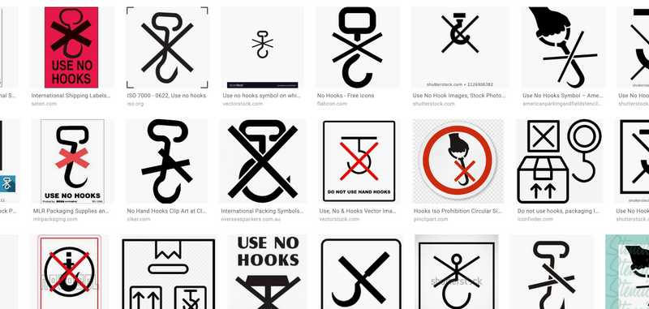

##### Continued from [part 1](/july-18-2019)

## (Backstory) The last time we deployed a hook to production...

We got this error, [Invalid Hook Call Warning](https://reactjs.org/warnings/invalid-hook-call-warning.html). I wasn't the one who authored those changes, but I was the one who recommended using a hook (`useState`). We immediately had to revert the deployment, and I ended up removing the hook and using our existing `recompact.withState` style of functional component state management.

I don't remember or know for sure why our site broke, but I'm guessing it's because we had mixed usage of `recompact`'s HOCs and hooks.

## Today. We have two hooks in production.

When I joined [Capsule](https://www.capsulecares.com) at the end of April 2019, the React version was `16.3.2`. This meant [hooks](https://reactjs.org/docs/hooks-intro.html) weren't possible yet, (or even [React.memo](https://reactjs.org/docs/react-api.html#reactmemo)). We've since upgraded to <code>[16.8.6](https://github.com/facebook/react/blob/master/CHANGELOG.md#1686-march-27-2019)</code> because of a security issue with `react-dom@16.3.2`. This paved the way for hooks becoming a possibility, and as of this past week, I shipped our first two hooks to production:

- React's built-in, `useState`
- Launch Darkly's `useFlags`

## Why do hooks matter?

No one on my team is necessarily that interested in hooks, and no one seems to be particularly against it. So why do hooks matter? On one hand, they don't really matter. I just think they're cool and clean. On the other hand, they're like a really good user interface - you **learn** from simply looking at the code written with hooks - which is a total improvement.

### But in our case, it's reducing tech debt

However, in the context of our app, they mark a pretty significant turning point in architecture style. All of our components are functional components that depend heavily on a library that became deprecated due to hooks being released. Any further usage of this library would simply be adding **technical debt** to our codebase, so slowly transitioning to hooks is, IMO, an unarguably wise move.

## Todos?

### react-redux@7.x

Next, I want to team buy-in to update our [react-redux](https://react-redux.js.org/) version from 5.x to [7.x](https://github.com/reduxjs/react-redux/releases), which introduces their own hooks: `useSelector` and `useDisptach`. This would eliminate our need for injecting a billion props from a higher order component...

```javascript
import { connect } from "react-redux"
// import some actions

const mapStateToProps = (state, ownProps) => {
  // define a billion stateful props to be injected
  return { ...aBillionStatefulProps }
}

const mapDispatchToProps = (dispatch, ownProps?) => {
  // define a billion dispatcher functions to be injected
  return { ...aBillionDispatchers }
}

// inject props
export default connect(
  mapStateToProps,
  mapDispatchToProps
)(DumbComponent)
```

...and we can define a single function component like this instead...

```javascript
import { useSelector, useDispatch } from "react-redux"
// import some actions

const HookedOnRedux = () => {
  const statefulValue = useSelector(state => state.statefulValue)
  const anotherValue = useSelector(state => state.anotherValue)

  const dispatch = useDispatch()
  const dispatchUpdateSomething = dispatch(someAction(someArg))

  return <>stuff</>
}
```

This could get messy, but I read somewhere that a larger component would be expected with hooks... (Argh, can't find it.) Only one way to find out.

### Write some custom hooks for the team

The built in hooks have covered every usecase i've encountered so far, but I do want to write some custom hooks that could benefit our team.
