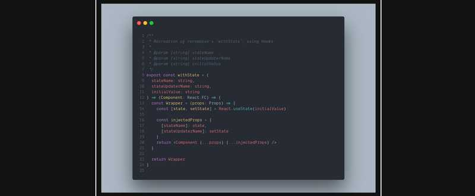

## Recompact at work

At work, our components are separated into [smart and dumb components](https://medium.com/@dan_abramov/smart-and-dumb-components-7ca2f9a7c7d0), with both being function components. It is also worth noting that the project was created before hooks existed, and so, uses [Recompact](https://github.com/neoziro/recompact) to enable various class component features. But of course, now hooks exist and both Recompact (and [Recompose](https://github.com/acdlite/recompose)) are deprecated as a result.

---

## The Presentational/Container component separation is outdated

I'm no React wiz, but if [Dan Abramov](https://twitter.com/dan_abramov?lang=en) states, in 2019, that you shouldn't split your components like this anymore, I think it's safe to say, "you shouldn't split your components like this anymore".

### But what if you must use P/C components?

Moving an entire mature app away from 1.) Recompact, and 2.) Presentational/Container components, won't realistically happen, at least not in a short amount of time. Especially when you have to get buy-in from your team, probably do all the conversion work yourself, and test everything.

I decided to see what if I could create a hooks-implementation of a recompact method.

---

## Recreating `withState`, with hooks

For kicks, I tried to recreate `withState`, with hooks.

### Original Usage

Here's an example case of how to use Recompact's `withState` method.

```typescript
import React from "react"
import { withState, compose } from "recompact"

const Dumb = ({ count, setCount }) => {
  return (
    <>
      <div>{count}</div>
      <button onClick={() => setCount(count + 1)}>Increment</button>
    </>
  )
}

// prettier-ignore
const Smart = compose(
  withState("count", "setCount", 0)
)(Dumb);
```

### My `withState`, with hooks

```typescript
import React, { useState, memo } from "react"

export const withState = (
  stateName: string,
  stateUpdaterName: string,
  initialValue: string
) => (Component: React.FC) => {
  const Wrapper = memo(props => {
    const [state, setState] = useState(initialValue)

    const injectedProps = {
      [stateName]: state,
      [stateUpdaterName]: setState,
    }
    return <Component {...props} {...injectedProps} />
  })

  return Wrapper
}
```

### New Usage...?

It would be implemented exaclty the same. Nice.

---

## Alas, my first library is born

This task inspired me (lol, I inspired myself) to create a library so that others could reuse this. Thus, my first react library came into being, one evening. I have yet to dig deeper into this, as well as the whole npm publishing, but this is what I have after one quick evening.

https://github.com/thiskevinwang/with-hooks

---

## Related

###Are injected props an anti-pattern?

I'm not qualified to say _**yes**_ or ~~no~~, but I agree with what [Paul Henschel](https://twitter.com/0xca0a) has to [say](https://twitter.com/0xca0a/status/1147099945368993793).

This type of composition does force the presentational components to expect specific props, make them essentially **not reusable** and it is also cumbersome to track down where ~~the fuck~~ the props are coming from in some messy cases.
