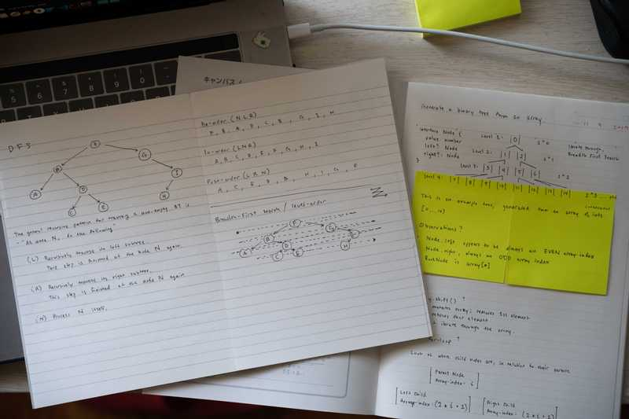

<figure style="text-align: center">
  
  <small style="color: grey">"Some binary tree notes"</small>
</figure>

Every now and then, someone says something that may not mean that much to themself, but ends up having a huge impact on me. Some time late last week, a few coworkers and I were chatting about interviews. One of them said that they've been asked to implement a **binary search** and followed it up with, _**"yea, I think that's pretty standard"**_.

I sat there casually, taking a moment to process the comment. (In my mind, I associated "binary search" with **binary search tree** & **binary trees** in general.) And all of a sudden, it felt like reality hit me and a red flag was raised.

I knew in the back of my head that I didn't really understand binary trees at all. It's something that you learn about in computer science classes, but I went to music school so... I also knew that it was probably something I should learn at some point, but had always kept it on the back burner so that I could spend my time on more entertaining things, like learning React, learning Python, or window shopping on Amazon.

No more putting it off...

## Code Wars Saves the Day

I learn by applying, so simply reading blog posts/articles has never ever worked for me. I stopped doing exercises on [Code Wars](https://www.codewars.com/) over a year ago, because I started actually buildings things like my website and this blog. But those two never helped me get better at algorithms or data structures. So, with the goal of improving my binary tree understanding, I revisited Code Wars.

Here are a few fun ones I did.

- [Sum The Tree](https://www.codewars.com/kata/sum-the-tree/javascript)
- [Fun with trees: max sum](https://www.codewars.com/kata/fun-with-trees-max-sum/javascript)
- [Fun with trees: array to tree](https://www.codewars.com/kata/fun-with-trees-array-to-tree/javascript) - I'm writing about this one.

### "Fun with trees: array to tree"

I attempted this in the middle of the week, and got totally stuck. Then I revisited this Saturday morning, and actually attacked it, pen and paper first. (See the silly picture)

Some things I asked myself...

- Do I iterate through the array with a for-loop?
- Should I think of the array as a **Queue**?
  - Do I need `Array.shift()`?
- Do I need recursion?
- Can I visualize this? And would that help?

#### My Solution

```js
/**
 * TreeNode is predefined as a courtesy
 */
var TreeNode = function(value, left, right) {
  this.value = value
  this.left = left
  this.right = right
}

function arrayToTree(array) {
  if (array.length < 1) return undefined

  const RootNode = new TreeNode(array[0])

  /**
   * helper
   * our recursive helper function
   *
   * @param {TreeNode} node   Our relative root node, for each recursive
   *                          call.
   * @param {number} i        This is our state that we pass down with
   *                          recursive call.
   */
  const helper = (node, i) => {
    if (!node) return

    // `i` is important, as it's what we base our left/right child
    // nodes off of.
    //
    // What if the array has duplicate values?
    // - You cannot do:
    //     const i = array.indexOf(node.value)
    // - Instead, pass the index as state with each
    //   recursive call

    // This was my hint
    const leftChildIndex = 2 * i + 1
    const rightChildIndex = 2 * i + 2

    const leftChildValue = array[leftChildIndex]
    const rightChildValue = array[rightChildIndex]

    // Build left & right child nodes
    if (leftChildValue !== undefined) {
      node.left = new TreeNode(leftChildValue)
    }
    if (rightChildValue !== undefined) {
      node.right = new TreeNode(rightChildValue)
    }

    // Recursively call `helper` on each child node, and pass along
    // their relative index as "state"
    helper(node.left, leftChildIndex)
    helper(node.right, rightChildIndex)
  }

  helper(RootNode, 0)
  return RootNode
}
```

#### Someone Else's Uber Clever Solution

```js
function arrayToTree(values, i = 0) {
  if (i >= values.length) return
  return new TreeNode(
    values[i],
    arrayToTree(values, 2 * i + 1),
    arrayToTree(values, 2 * i + 2)
  )
}
```

## What I Learned

Or... what I am forcing myself to take away from this.

### Pass Down State

A useful trick with recursive functions is to expose an extra argument that holds "some state". This way each recursive call has some knowledge of the previous call.

For example: The `i` parameter from the function above.

```js
const helper = (node, i) => { //...
```

- When calling the recursive helper, you pass it a child node's index within the array.
  - Or you pass it `0` when calling it for the first time.
- When accessing this value from the body of the recursive helper, its value is now available as a "parent node index".

### Relative Left and Right Children Indices

Whatever `i` is, the left and right child node's indices are always `2 * i + 1` and `2 * i + 2`, respectively. Why? I'm not 100% sure, but I'll just assume it as a hard truth, when generating a **Level Order Binary Tree**.

### Time Complexity

**O(n)** - _"Each node is visited once, so it's linear time"._

# Next Steps?

For me? I dunno. Keep at it I guess.

For you? Enjoy this climbing video I made!

Connie and I sent our first V9's last weekend - Blair Witch @ Ice Pond, NY

<iframe width="560" height="315" src="https://www.youtube.com/embed/aoVjckUKNTQ" frameborder="0" allow="accelerometer; autoplay; encrypted-media; gyroscope; picture-in-picture" allowfullscreen></iframe>
