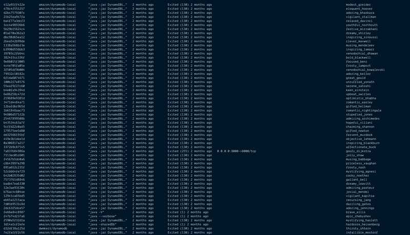

Notes & Commands from my first _real_ attempt at learning Docker (...but I probably spent more time fiddling with markdown styling & css of this post)

## List Containers

<details>
  <summary><code>docker ps</code> syntax</summary>

```
docker ps [OPTIONS]
```

[ps-docs](https://docs.docker.com/engine/reference/commandline/ps/)

</details>

```bash
docker ps

# CONTAINER ID        IMAGE                   COMMAND                  CREATED             STATUS              PORTS                              NAMES
# e9e1f48613d9        amazon/dynamodb-local   "java -jar DynamoDBL…"   9 seconds ago       Up 8 seconds        8000/tcp, 0.0.0.0:8000->8008/tcp   festive_lamport
```

## List Docker Images

<details>
  <summary><code>docker images</code> syntax</summary>

```
docker images [OPTIONS] [REPOSITORY[:TAG]]
```

[images-docs](https://docs.docker.com/engine/reference/commandline/images/)

</details>

```bash
docker images

# REPOSITORY                TAG                 IMAGE ID            CREATED             SIZE
# amazon/dynamodb-local     latest              d0e7e8b4a50a        8 months ago        506MB
# node                      7.2.1-alpine        a1c188c2c5e1        2 years ago         55.3MB
```

## Pull an image or a repository from a registry

<details>
  <summary><code>docker pull</code> syntax</summary>

```
docker pull [OPTIONS] NAME[:TAG|@DIGEST]
```

[pull-docs](https://docs.docker.com/engine/reference/commandline/pull/)

</details>

```bash
docker pull amazon/dynamodb-local
#           [NAME]
#           amazon/dynamodb-local
```

## Run a command in a new container

<details>
  <summary><code>docker run</code> syntax</summary>

```
docker run [OPTIONS] IMAGE [COMMAND][arg...]
```

[run-docs](https://docs.docker.com/engine/reference/commandline/run/)

</details>

```bash
docker run -p 8000:8000 amazon/dynamodb-local
           ├ [Options]
           # -p (Host:Container)
                        ├ [Image]
                        # amazon/dynamodb-local
```

<details>
  <summary><code>docker run</code> options</summary>

| Name, shorthand    | Default | Description                                                                                                                            |
| :----------------- | :------ | :------------------------------------------------------------------------------------------------------------------------------------- |
| `--publish` , `-p` |         | Publish a container’s port(s) to the host. See [container-networking](https://docs.docker.com/config/containers/container-networking/) |
| `--detach` , `-d`  |         | Run container in background and print container ID                                                                                     |

</details>

## Run a command in a running container

<details>
  <summary><code>docker exec</code> syntax</summary>

```
docker exec [OPTIONS] CONTAINER COMMAND [ARG...]
```

[exec-docs](https://docs.docker.com/engine/reference/commandline/exec/)

</details>

```
docker exec ...
```

<details>
  <summary>Example: <b>List files in a running container</b></summary>

```bash
docker ps -al

# CONTAINER ID        IMAGE               COMMAND                  CREATED             STATUS              PORTS               NAMES
# a928b1a90fb3        postgres            "docker-entrypoint.s…"   47 hours ago        Up 46 hours         5432/tcp            docker-compose-django_db_1

docker exec a928b1a90fb3 ls

# bin
# boot
# dev
# docker-entrypoint-initdb.d
# docker-entrypoint.sh
# etc
# home
# lib
# lib64
# media
# mnt
# opt
# proc
# root
# run
# sbin
# srv
# sys
# tmp
# usr
# var
```

</details>

## Deleting unused containers

<details>
  <summary><code>docker system prune</code> syntax</summary>

```bash
docker system prune [OPTIONS]
       ├ [base]
       # system
              ├ [COMMAND]
              # prune

```

[system docs](https://docs.docker.com/engine/reference/commandline/system/)

[system prune docs](https://docs.docker.com/engine/reference/commandline/system_prune/)

</details>

```bash
docker system prune
```

<details>
<summary>Example</summary>

```bash
docker system prune

# WARNING! This will remove:
#  - all stopped containers
#  - all networks not used by at least one container
#  - all dangling images
#  - all dangling build cache
#
# Are you sure you want to continue? [y/N]

y

# Deleted Containers:
# 8bc3730ccf92cde2ba71648487810af163fb3f765a4f9e2e310e5f2eeab1e08e
# ...(truncated)

# Deleted Networks:
# ...(truncated)

# Deleted Images:
# deleted: sha256:6938bb2bf6917e2d4e2e0af781b199e2643b6d1d27b00f993a5c7770faa23c76
# deleted: sha256:47e443d20a18d3720df4afc842529527e0a0fdb18641421c4bf17c3636728e1f
# ...(truncated)

# Deleted build cache objects:
# vbv35t98brzqtai4ryp7iq7hq
# ypjmoyte081rvb2y69sgktqi0
# ...(truncated)

# Total reclaimed space: 754.3MB
```

Before: <code>docker ps -al</code>



After: <code>docker ps -al</code>


</details>

# Docker Compose

<details>
  <summary>Notes</summary>

[compose-docs](https://docs.docker.com/compose/)

<h3>What is docker-compose?</h3>

- _"A tool for defining and running multi-container Docker applications"_
- _"You use a YAML file to configure your application’s services"_

<h3>3 step process to using docker-compose</h3>

1. Define your app’s environment with a **Dockerfile** so it can be reproduced anywhere.

2. Define the services that make up your app in `docker-compose.yml` so they can be run together in an isolated environment.

3. Run `docker-compose up` and **Compose** starts and runs your entire app.

</details>

## Usage with Django + PostgreSQL

I just started learning Django last week, so coming across this is a perfect coincidence.

[compose + django docs](https://docs.docker.com/compose/django/)

1. `Dockerfile`

```Dockerfile
FROM python:3
ENV PYTHONUNBUFFERED 1
RUN mkdir /code
WORKDIR /code
COPY requirements.txt /code/
RUN pip install -r requirements.txt
COPY . /code/
```

<details>
  <summary>Explanation</summary>

| Statement                                                              | Params                            | What's going on?                                                                                                                                                                                                          |
| :--------------------------------------------------------------------- | :-------------------------------- | :------------------------------------------------------------------------------------------------------------------------------------------------------------------------------------------------------------------------ |
| [`FROM`](https://docs.docker.com/engine/reference/builder/#from)       | `python:3`                        | This Dockerfile starts with ha Python 3 parent image                                                                                                                                                                      |
| [`ENV`](https://docs.docker.com/engine/reference/builder/#env)         | `PYTHONUNBUFFERED` `1`            | Set environment variable                                                                                                                                                                                                  |
| [`RUN`](https://docs.docker.com/engine/reference/builder/#run)         | `mkdir /code`                     | Add a new directory to the image                                                                                                                                                                                          |
| [`WORKDIR`](https://docs.docker.com/engine/reference/builder/#workdir) | `/code`                           | Set working directory to `code/` for following `RUN`, `CMD`, `ENTRYPOINT`, `COPY`, `ADD` commands                                                                                                                         |
| [`COPY`](https://docs.docker.com/engine/reference/builder/#copy)       | `requirements.txt` `/code/`       | Copy files/dirs from `<src>` to the filesystem of the container, `<dest>` <br/> <li>`src` is relative to the source of the context of the build</li> <li>`dest` is an absolute path, or a path relative to `WORKDIR`</li> |
| `RUN`                                                                  | `pip install -r requirements.txt` | Run pip install on the container                                                                                                                                                                                          |
| `COPY`                                                                 | `.` `/code/`                      | ?                                                                                                                                                                                                                         |

</details>

<br>

`requirements.txt`

```txt
Django>=2.0,<3.0
psycopg2>=2.7,<3.0
```

<details>
  <summary>What's this for?</summary>

This file is used by the `RUN pip install -r requirements.txt` command in the `Dockerfile`.

</details>

<br>

`docker-compose.yml`

```yaml
version: "3"

services:
  db:
    image: postgres
  web:
    build: .
    command: python manage.py runserver 0.0.0.0:8000
    volumes:
      - .:/code
    ports:
      - "8000:8000"
    depends_on:
      - db
```

<details>
  <summary>Uh, what?</summary>

[Compose file reference](https://docs.docker.com/compose/compose-file/)

<h3>This describes</h3>

- the services, `db` & `web`, which make up the app.
- which Docker [images](https://docs.docker.com/compose/compose-file/#image) the services use
- how they link together
- [volumes](https://docs.docker.com/compose/compose-file/#volumes) they need mounted inside the containers.
- the ports the services expose

| Key                                                                      | Description                                                                                                                                                                                                                       |
| :----------------------------------------------------------------------- | :-------------------------------------------------------------------------------------------------------------------------------------------------------------------------------------------------------------------------------- |
| [`image`](https://docs.docker.com/compose/compose-file/#image)           | Specify the image to start the container from. Can either be a repository/tag or a partial image ID.                                                                                                                              |
| [`volumes`](https://docs.docker.com/compose/compose-file/#volumes)       | Mount host paths or named volumes, specified as sub-options to a service. <br/>Here, the web service uses a volume that is defined using the old string format for mountain a volume. <br/> Uses "short syntax": `HOST:CONTAINER` |
| [`depends_on`](https://docs.docker.com/compose/compose-file/#depends_on) | Express dependency between services. `docker-compose up` starts services in "dependency order". So, `db` starts before `web`                                                                                                      |

</details>

### Create a Django Project

<details>
  <summary>Syntax</summary>

```
run [options] [-v VOLUME...] [-p PORT...] [-e KEY=VAL...] [-l KEY=VALUE...] SERVICE [COMMAND] [ARGS...]
```

[docker-compose run docs](https://docs.docker.com/compose/reference/run/)

Runs a one-time command against a service.

The following command instructs Compose to run `django-admin startproject composeexample` in a container, using the `web` service's image and configuration.

Because the `web` image doesn't exist yet, Compose builds it from the current directory, as specified by the `build: .` line in `docker-compose.yml`

</details>

```bash
sudo docker-compose run web django-admin startproject composeexample .
#                       [SERVICE]
#                       web
#                           [COMMAND]
#                           django-admin startproject composeexample
#                           - "create a project called composeexample"
#                                                                 [ARGS]
#                                                                 .
```

<details>
  <summary>Sample Terminal Log</summary>

```
~/r/docker-compose-django $
~/r/docker-compose-django $ touch Dockerfile
~/r/docker-compose-django $ vim Dockerfile
~/r/docker-compose-django $ touch requirements.txt
~/r/docker-compose-django $ vim requirements.txt
~/r/docker-compose-django $ touch docker-compose.yml
~/r/docker-compose-django $ vim docker-compose.yml
~/r/docker-compose-django $ sudo docker-compose run web django-admin startproject composeexample .
Password:
Creating network "docker-compose-django_default" with the default driver
Pulling db (postgres:)...
latest: Pulling from library/postgres
b8f262c62ec6: Pull complete
fe6da876d968: Pull complete
46b9d53972f5: Pull complete
23a11bddcc75: Pull complete
d6744ba78bdc: Pull complete
8d95423a7aa9: Pull complete
8590ba4183e5: Pull complete
ed97b9b8e039: Pull complete
d9b574d4da1e: Pull complete
04119344259c: Pull complete
774edf2116fc: Pull complete
2d839f35fc94: Pull complete
77d2dd4efe0a: Pull complete
22c5d24859af: Pull complete
Digest: sha256:3dbb3cb945dfe0316dcdd3a75e8a3c6192ce30f87a9952f285b9ba2f02b81982
Status: Downloaded newer image for postgres:latest
Creating docker-compose-django_db_1 ... done
Building web
Step 1/7 : FROM python:3
3: Pulling from library/python
4a56a430b2ba: Pull complete
4b5cacb629f5: Pull complete
14408c8d4f9a: Pull complete
ea67eaa7dd42: Pull complete
4d134ac3fe4b: Pull complete
4c55f6f5d7f0: Pull complete
6ae475e50652: Pull complete
6f4152644229: Pull complete
6933d3d46042: Pull complete
Digest: sha256:9455815814cd05da0fe73fba64dbed5a3dcb582c757b6c7591c49178c3a4398c
Status: Downloaded newer image for python:3
 ---> 02d2bb146b3b
Step 2/7 : ENV PYTHONUNBUFFERED 1
 ---> Running in 4eb161cc1ff9
Removing intermediate container 4eb161cc1ff9
 ---> c47637decb35
Step 3/7 : RUN mkdir /code
 ---> Running in dac0b2776f8c
Removing intermediate container dac0b2776f8c
 ---> 906b1e10b143
Step 4/7 : WORKDIR /code
 ---> Running in 19cecd5bb2d9
Removing intermediate container 19cecd5bb2d9
 ---> 606becca4aea
Step 5/7 : COPY requirements.txt /code/
 ---> 98b4d6c6d83e
Step 6/7 : RUN pip install -r requirements.txt
 ---> Running in 61c6a6b94003
Collecting Django<3.0,>=2.0 (from -r requirements.txt (line 1))
  Downloading https://files.pythonhosted.org/packages/b2/79/df0ffea7bf1e02c073c2633702c90f4384645c40a1dd09a308e02ef0c817/Django-2.2.6-py3-none-any.whl (7.5MB)
Collecting psycopg2<3.0,>=2.7 (from -r requirements.txt (line 2))
  Downloading https://files.pythonhosted.org/packages/5c/1c/6997288da181277a0c29bc39a5f9143ff20b8c99f2a7d059cfb55163e165/psycopg2-2.8.3.tar.gz (377kB)
Collecting sqlparse (from Django<3.0,>=2.0->-r requirements.txt (line 1))
  Downloading https://files.pythonhosted.org/packages/ef/53/900f7d2a54557c6a37886585a91336520e5539e3ae2423ff1102daf4f3a7/sqlparse-0.3.0-py2.py3-none-any.whl
Collecting pytz (from Django<3.0,>=2.0->-r requirements.txt (line 1))
  Downloading https://files.pythonhosted.org/packages/e7/f9/f0b53f88060247251bf481fa6ea62cd0d25bf1b11a87888e53ce5b7c8ad2/pytz-2019.3-py2.py3-none-any.whl (509kB)
Building wheels for collected packages: psycopg2
  Building wheel for psycopg2 (setup.py): started
  Building wheel for psycopg2 (setup.py): finished with status 'done'
  Created wheel for psycopg2: filename=psycopg2-2.8.3-cp37-cp37m-linux_x86_64.whl size=465788 sha256=6d3889e010861b408ec9cc225ca637438d0394685fd4ae5daf324eb79e671eb7
  Stored in directory: /root/.cache/pip/wheels/48/06/67/475967017d99b988421b87bf7ee5fad0dad789dc349561786b
Successfully built psycopg2
Installing collected packages: sqlparse, pytz, Django, psycopg2
Successfully installed Django-2.2.6 psycopg2-2.8.3 pytz-2019.3 sqlparse-0.3.0
Removing intermediate container 61c6a6b94003
 ---> febdc392632b
Step 7/7 : COPY . /code/
 ---> e17ab833112b
Successfully built e17ab833112b
Successfully tagged docker-compose-django_web:latest
WARNING: Image for service web was built because it did not already exist. To rebuild this image you must use `docker-compose build` or `docker-compose up --build`.
```

</details>

### Connect the database

These steps are Django specific. See [Connect the database](https://docs.docker.com/compose/django/#connect-the-database)

### Start your Django Project

<details>
  <summary>Syntax</summary>

```
docker-compose up [options] [--scale SERVICE=NUM...] [SERVICE...]
```

[docker-compose up docs](https://docs.docker.com/compose/reference/up/)

</details>

```bash
docker-compose up
```

<details>
  <summary>Sample Terminal Log</summary>

```
~/r/docker-compose-django $ docker-compose up                                                                               11:59:26
Starting docker-compose-django_db_1 ... done
Recreating docker-compose-django_web_1 ... done
Attaching to docker-compose-django_db_1, docker-compose-django_web_1
db_1   | 2019-10-12 15:59:45.658 UTC [1] LOG:  starting PostgreSQL 12.0 (Debian 12.0-2.pgdg100+1) on x86_64-pc-linux-gnu, compiled by gcc (Debian 8.3.0-6) 8.3.0, 64-bit
db_1   | 2019-10-12 15:59:45.658 UTC [1] LOG:  listening on IPv4 address "0.0.0.0", port 5432
db_1   | 2019-10-12 15:59:45.658 UTC [1] LOG:  listening on IPv6 address "::", port 5432
db_1   | 2019-10-12 15:59:45.661 UTC [1] LOG:  listening on Unix socket "/var/run/postgresql/.s.PGSQL.5432"
db_1   | 2019-10-12 15:59:45.674 UTC [25] LOG:  database system was interrupted; last known up at 2019-10-12 15:59:09 UTC
db_1   | 2019-10-12 15:59:45.761 UTC [25] LOG:  database system was not properly shut down; automatic recovery in progress
db_1   | 2019-10-12 15:59:45.763 UTC [25] LOG:  redo starts at 0/1645598
db_1   | 2019-10-12 15:59:45.763 UTC [25] LOG:  invalid record length at 0/16455D0: wanted 24, got 0
db_1   | 2019-10-12 15:59:45.763 UTC [25] LOG:  redo done at 0/1645598
db_1   | 2019-10-12 15:59:45.773 UTC [1] LOG:  database system is ready to accept connections
web_1  | Watching for file changes with StatReloader
web_1  | Performing system checks...
web_1  |
web_1  | System check identified no issues (0 silenced).
web_1  |
web_1  | You have 17 unapplied migration(s). Your project may not work properly until you apply the migrations for app(s): admin, auth, contenttypes, sessions.
web_1  | Run 'python manage.py migrate' to apply them.
web_1  | October 12, 2019 - 15:59:47
web_1  | Django version 2.2.6, using settings 'composeexample.settings'
web_1  | Starting development server at http://0.0.0.0:8000/
web_1  | Quit the server with CONTROL-C.
```

</details>

### Stop your Django Project

<details>
  <summary>Syntax</summary>

```
docker-compose down [options]
```

[docker-compose down docs](https://docs.docker.com/compose/reference/down/)

</details>

```bash
docker-compose down
# ctrl + c
```

### 17 unapplied migration(s)?

```bash
docker-compose run python manage.py migrate
# ERROR: No such service: python
```

```bash
docker-compose run web python manage.py migrate
# Starting docker-compose-django_db_1 ... done
# Operations to perform:
#   Apply all migrations: admin, auth, contenttypes, sessions
# Running migrations:
#   Applying contenttypes.0001_initial... OK
#   Applying auth.0001_initial... OK
#   Applying admin.0001_initial... OK
#   Applying admin.0002_logentry_remove_auto_add... OK
#   Applying admin.0003_logentry_add_action_flag_choices... OK
#   Applying contenttypes.0002_remove_content_type_name... OK
#   Applying auth.0002_alter_permission_name_max_length... OK
#   Applying auth.0003_alter_user_email_max_length... OK
#   Applying auth.0004_alter_user_username_opts... OK
#   Applying auth.0005_alter_user_last_login_null... OK
#   Applying auth.0006_require_contenttypes_0002... OK
#   Applying auth.0007_alter_validators_add_error_messages... OK
#   Applying auth.0008_alter_user_username_max_length... OK
#   Applying auth.0009_alter_user_last_name_max_length... OK
#   Applying auth.0010_alter_group_name_max_length... OK
```

## Recap: "Anatomy of a docker-compose command"

```bash
docker-compose run web python manage.py migrate
├ [base]
  # docker-compose run
                   ├ [service]
                   # web
                   # ...see docker-compose.yml
                       ├ [command]
                       # python manage.py migrate
```

## Recap: "Where are my containers?"

```bash
docker ps
```

## Glossary

After 2 days of writing this Docker blog post, I figured out how to use Docker, but realized that I still couldn't define some key terms... So here are some of them... for myself.

| Term                                                                  | Definition                                                                                                                                                                                                                                                                                                                                                                                                                                    |
| :-------------------------------------------------------------------- | :-------------------------------------------------------------------------------------------------------------------------------------------------------------------------------------------------------------------------------------------------------------------------------------------------------------------------------------------------------------------------------------------------------------------------------------------- |
| [container](https://docs.docker.com/glossary/?term=container)         | A container is a runtime instance of a docker image.                                                                                                                                                                                                                                                                                                                                                                                          |
| [image](https://docs.docker.com/glossary/?term=image)                 | Docker images are the basis of containers. An Image is an ordered collection of root filesystem changes and the corresponding execution parameters for use within a container runtime. An image typically contains a union of layered filesystems stacked on top of each other. An image does not have state and it never changes.                                                                                                            |
| [layer](https://docs.docker.com/glossary/?term=layer)                 | In an image, a layer is modification to the image, represented by an instruction in the Dockerfile. Layers are applied in sequence to the base image to create the final image. When an image is updated or rebuilt, only layers that change need to be updated, and unchanged layers are cached locally. This is part of why Docker images are so fast and lightweight. The sizes of each layer add up to equal the size of the final image. |
| [base image](https://docs.docker.com/glossary/?term=base%20image)     | An image that has no parent is a base image.                                                                                                                                                                                                                                                                                                                                                                                                  |
| [parent image](https://docs.docker.com/glossary/?term=parent%20image) | An image’s parent image is the image designated in the `FROM` directive in the image’s Dockerfile. All subsequent commands are applied to this parent image. A Dockerfile with no `FROM` directive has no parent image, and is called a base image.                                                                                                                                                                                           |
