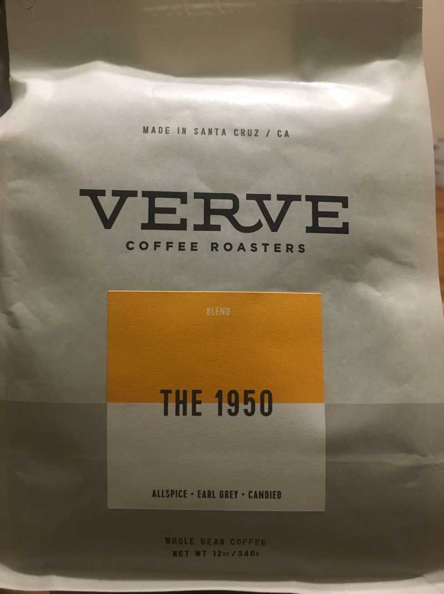

After finishing off the day at my internship [Dearest.io](https://dearest.io), I walked from the West Village over to meet my girlfriend, Connie, in Chinatown where she was getting some old film from disposable cameras developed.

All I ate for the day was a little tupperware full of Planters peanuts. Connie took me to [Golden King Bakery](https://www.google.com/maps/place/Golden+King+Bakery/@40.717393,-73.9953688,20.02z/data=!4m12!1m6!3m5!1s0x89c25988228b4049:0x3f4674940bf575b5!2sEliz+Digital+Inc!8m2!3d40.717922!4d-73.9962386!3m4!1s0x89c259881d42a615:0x24207e704ce1caa5!8m2!3d40.7174536!4d-73.9955659), which really reminded me of our time in Hong Kong. We ate some [lo mai gai](https://en.wikipedia.org/wiki/Lo_mai_gai) (not to be confused with [zongzi](https://en.wikipedia.org/wiki/Zongzi)) that they stored in this large, stainless steel steaming vat of sorts. It was probably there all day... and it was delicious.

After finishing up, we decided to hustle towards the nearest F train (Broadway Lafayette) - we had a 1.5 hr commute, back to Bayside, ahead of us.

Whenever I pass by a coffeeshop, I always like to peek through the window to try and see what coffee roasters they serve coffee from. We passed by some shop on bowery across from the Nudie Jeans store - they carried Toby's. Then we passed [Odd Fellows](https://www.oddfellowsnyc.com/) ice cream - they carried Verve. I don't remember the last time I tried Verve, as they're pretty rare here in New York. I picked up a bag for **\$16.50**

I'll have to wait until tomorrow morning to brew some... but I'll try to report back.

### Here are some TODOs for myself

- [ ] Report back about coffee: Verve, "The 1950"
- [ ] Research how to implement commenting on this blog
- [ ] Take more pics 📸 / 🤳
- [ ] Implement some kind of search feature

And, goodnight 😴
